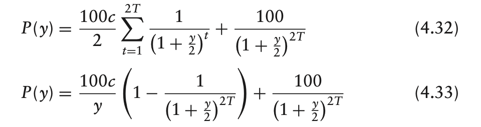
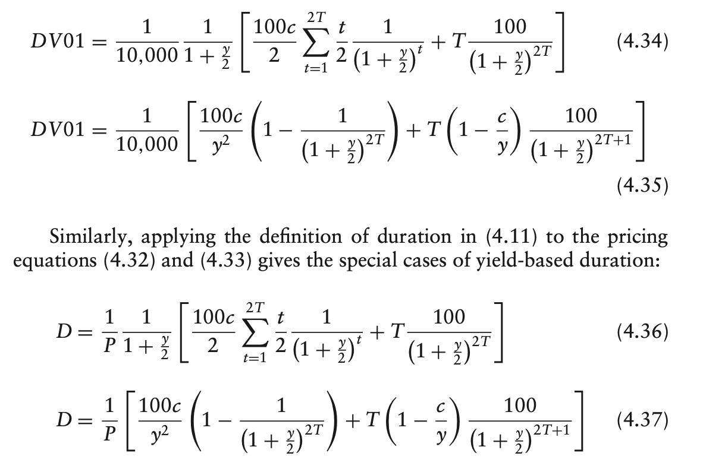

# Part Two
**Measures of interest rate risk and hedging**
**IR risk** of a security is measured by how much its price changes as interest rates change.
We need to know under different IR changing scenario, how our Portfolio will change.
Two types of formulations to model to model the changing of IR:
1. One-factor model:
   *Assumption*  changes in the rates for different terms are fully determined by the change in a single IR factor, the 10-year par rate.
2. Multi-factor model: use two or more factors, e.g. two-factor approach: level factor + slope factor => description of term structure movement

# One-factor Risk Metrics and hedges
Main concepts: DV01, duration and convexity
## DV01
P(y), the price-rate function , y is an IR factor.
DV01 = - dP/(dy/0.01%), DVO1 is an acronym for dollar value of an 01 (i.e. of .01%). The minus sign is used to make sure that we always have a positive DV01
**Attention** Most market participants use DV01 to mean yield-based DV01. Yield-based DV01 assumes that the yield-to-maturity of a particular security changes by one bps. To avoid confusion, some market participants have different names for DV01 measures according to the assumed change in rates.

## A Hedging application: A futures option
Say a market maker has sold the option TYU0C 120 and he will stand to lose money if rates fall, purchasing futures can hedge the resulting exposure.  The DV01 of the two securities can be used to figure out exactly how many futures should be bought against the short option position.
We want to have a match of DV01 for two portfolios.
F1*DV01_1 = F2*DV01_2
There are securities for which DV01 is negative, most notably in mort- gage derivatives.
In reality, the market maker would sell the options at some premium to their fair value。

## Duration
Duration measures the percentage change in the value of a security for a unit change in rates.
D= -1/p*dp/dy .

## Convexity
As interest rate sensitivity changes with the level of rates, we use convexity to measure this sensitivity.
C = 1/p*d^2p/dy^2 which is related to the second order derivative of the price-rate function.

## Hedging example
Duration hedging is local that is valid in a particular neighbourhood of rates. As rates move, the quality of the hedge deteriorates.
Short convexity: the hedged position loses whether rates rises or fall because the option is more convex than the bond
A long convexity is long volatility while a short convexity position is short volatility.

## Estimating price changes and returns with DV01,Duration and convexity
A second-order Taylor approximation of the price-rate function:
dp = dp/dy*dy+1/2d^2p/dy^2*dy^2 = > dp/p = -Ddy+1/2Cdy^2
It is generally true that duration term is much larger than convexity term in the above approximation.

- The convexity of portfolio is an exposure to volatility. In the investment context, choosing among securities with the same duration expresses a view on interest rate volatility. Choosing a very positively convex security would essentially be choosing to be long volatility and vice-versa.
- Asset-liability managers can achieve greater protection against interest rate changes by hedging duration and convexity instead of duration alone.(We need to hedge with two instruments with different convexity and duration).
- Duration and convexity of a set of securities can be computed by using the additivity of the calculation.

## Yield-based risk Metrics
Yield-based means that instead of price-rate function, we use price-yield function. Then we find the sensitivity of price related to yield. These measures have two important weakness:
1. Only defined for securities with fixed cash flows
2. Their use implicitly assumes parallel shifts in yield

Despite these weakness, for several reasons fixed income professionals must understand these measures:
1. simple to compute, easy to understand and in many situation, reasonable to use
2. widely used in the financial industry
3. much of the intuition gained from a full understanding of these measures carries over to more general measures of price sensitivity.

### Yield-Based DV01 and duration

where y is the yield. We can take the negative of the derivative of the two price expressions, dividing by 10000, then we will have the yield-based DV01.

These special cases are also known in the industry as modified or adjusted duration.
duration can be viewed as a weighted-sum of times to receipt, with each weight equal to the corresponding present value divided by the total of the present values, i.e., the price. The duration hence can be measured in years.

**Longer-dated** cash flows are more sensitive to interest rate changes because they are discounted over longer periods of time.

***Important limitation***:
Constructing a hedge so that the yield-based DV01 of a bond bought equals the yield based DV01 of a bond sold will work as intended only if the two bond yields change by the same amount. (In fact, yield is security specified amount which is different for different securities, so may be their changing along the time). We need to check the validity of the assumption in order to make sure the efficacy of the hedge method.

Some remarks:
1. any given maturity duration falls as coupon increases. The intuition behind this fact is that higher-coupon bonds have a greater fraction of their value paid earlier. The higher the coupon, the larger the weights on the duration terms of early years relative to those of later years. Hence, higher-coupon bonds are effectively shorter-term bonds and therefore have lower durations.

2. Duration increases with maturity.
